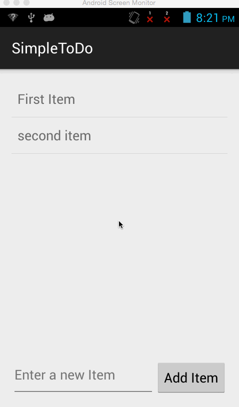

# AndroidWS
This is an Android demo application for displaying simple ToDo tasks. Follow the step-by-step turtorial with the cliffnotes

Completed tasks:

* [x] Reqired    Successfully add and remove items from the todo list within the app
* [x] Reqired    Include support for editing todo items as described in the tutorial
* [x] Reqired    App persists todo items and retrieve them properly on app restart.
* [x] Reqired    Successfully push your code to github.
* [x] Reqired    Adding a README which includes a GIF walkthrough of the app's functionality.
* [x] Reqired    Creating an issue on the repo and include /cc @codepathreview @codepath in the issue body.

Walkthrough of the first 3 user stories:

